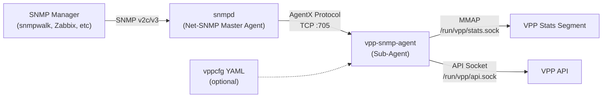
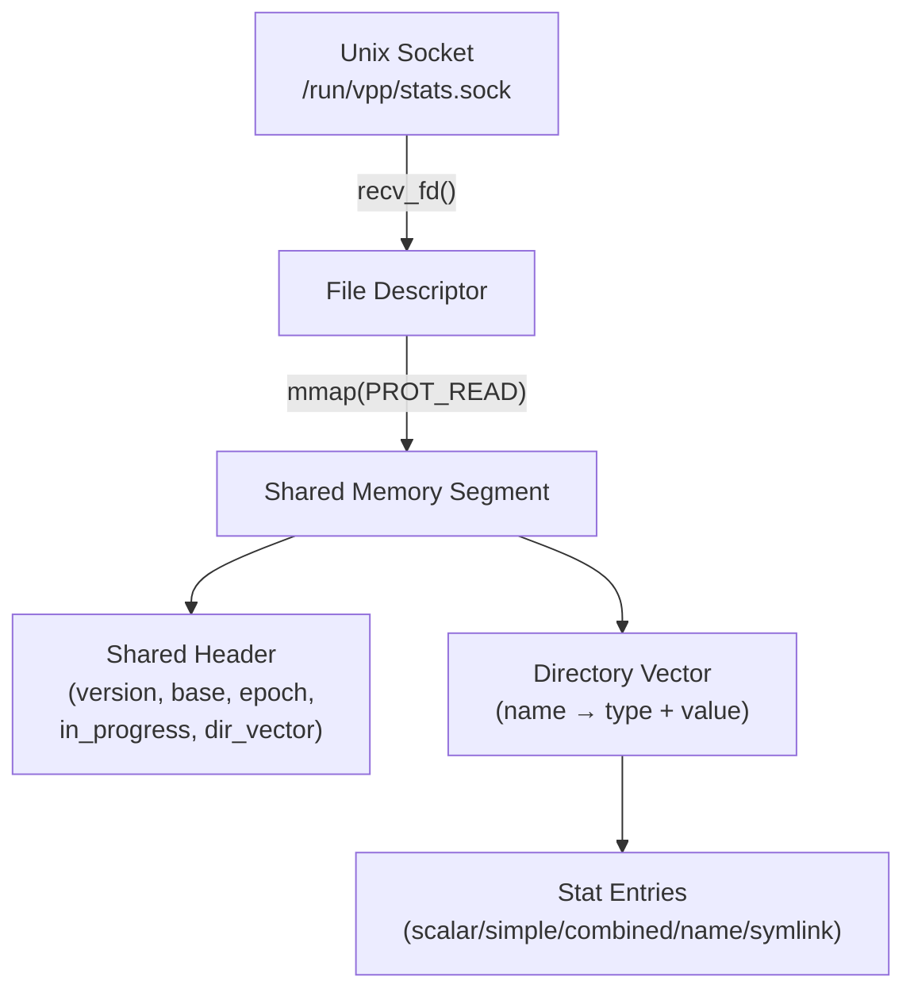
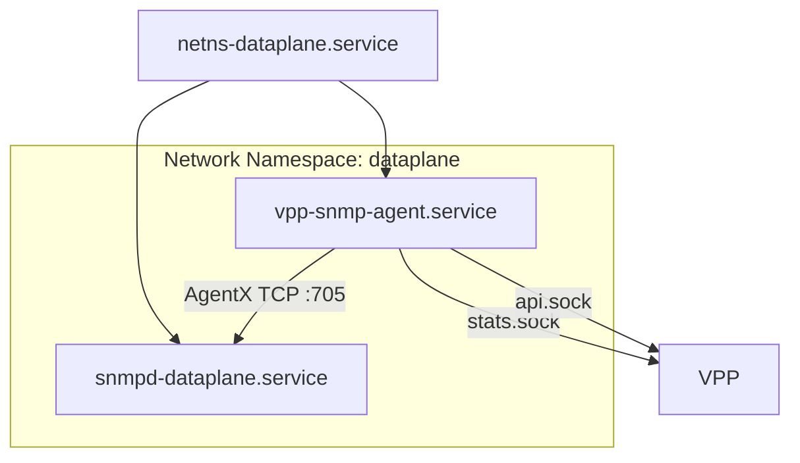

# VPP SNMP Agent — Repository Walkthrough

## Overview

**vpp-snmp-agent** adalah sebuah SNMP agent yang ditulis dalam Python yang mengimplementasikan protokol [AgentX (RFC 2257)](https://datatracker.ietf.org/doc/html/rfc2257). Agent ini menghubungkan VPP (Vector Packet Processing) dataplane ke infrastruktur monitoring SNMP, sehingga statistik interface VPP bisa di-query menggunakan tool SNMP standar (seperti `snmpwalk`, `snmpget`, Cacti, Zabbix, dll).

> [!IMPORTANT]
> Repo ini membutuhkan **VPP** yang berjalan di mesin yang sama, dengan plugin **linux-cp** aktif. Agent berjalan sebagai sub-agent dari Net-SNMP `snmpd`.

---

## Arsitektur



### Alur Data

1. **Polling berkala** (default: 30 detik): Agent mengambil data dari VPP Stats Segment (counter traffic) dan VPP API (metadata interface)
2. **DataSet dibangun**: Data dikumpulkan ke dalam `DataSet` berisi OID → value mapping sesuai IF-MIB
3. **DataSet diserving**: Saat `snmpd` menerima query SNMP, ia meneruskan request via AgentX ke agent
4. **Agent merespon**: Mengembalikan value yang diminta dari dataset yang sudah di-cache

---

## Struktur File

| File/Direktori | Deskripsi |
|---|---|
| [vpp-snmp-agent.py](file:///opt/vpp-snmp-agent/vpp-snmp-agent.py) | **Entry point** — `MyAgent` class, logic pengumpulan data & mapping OID |
| [vppapi.py](file:///opt/vpp-snmp-agent/vppapi.py) | Wrapper untuk VPP API (`vpp_papi`) — ambil interface metadata & LCP |
| [vppstats.py](file:///opt/vpp-snmp-agent/vppstats.py) | Akses langsung ke VPP Stats Segment via shared memory (MMAP) |
| [agentx/](file:///opt/vpp-snmp-agent/agentx) | Library AgentX protocol (fork refactored dari pyagentx) |
| [agentx/__init__.py](file:///opt/vpp-snmp-agent/agentx/__init__.py) | Konstanta protokol AgentX (PDU types, SNMP types, error codes) |
| [agentx/agent.py](file:///opt/vpp-snmp-agent/agentx/agent.py) | Base class `Agent` — main loop, setup/update lifecycle |
| [agentx/network.py](file:///opt/vpp-snmp-agent/agentx/network.py) | Koneksi socket AgentX, handling GET/GETNEXT PDU |
| [agentx/pdu.py](file:///opt/vpp-snmp-agent/agentx/pdu.py) | Encode/decode AgentX PDU (binary wire format) |
| [agentx/dataset.py](file:///opt/vpp-snmp-agent/agentx/dataset.py) | `DataSet` class — abstraksi OID → typed value mapping |
| [vpp-snmp-agent.yaml](file:///opt/vpp-snmp-agent/vpp-snmp-agent.yaml) | Contoh konfigurasi vppcfg (optional) |
| [vpp-snmp-agent.service](file:///opt/vpp-snmp-agent/vpp-snmp-agent.service) | Systemd unit untuk agent |
| [netns-dataplane.service](file:///opt/vpp-snmp-agent/netns-dataplane.service) | Systemd unit untuk network namespace `dataplane` |
| [snmpd-dataplane.service](file:///opt/vpp-snmp-agent/snmpd-dataplane.service) | Systemd unit untuk snmpd di network namespace dataplane |
| [vpp-snmp-agent.spec](file:///opt/vpp-snmp-agent/vpp-snmp-agent.spec) | PyInstaller spec untuk build binary |

---

## Module Deep Dive

### 1. `vpp-snmp-agent.py` — Main Agent

Class `MyAgent` extends `agentx.Agent` dan mengimplementasikan dua method utama:

#### `setup()` (line 66-95)
- Load konfigurasi YAML (opsional, dari flag `-c`)
- Connect ke VPP Stats Segment (`/run/vpp/stats.sock`)
- Connect ke VPP API (`/run/vpp/api.sock`)
- Register dua OID subtree:
  - `1.3.6.1.2.1.2.2.1` → **IF-MIB::ifTable** (ifEntry)
  - `1.3.6.1.2.1.31.1.1.1` → **IF-MIB::ifXTable** (ifXEntry)

#### `update()` (line 97-363)
Dipanggil setiap `period` detik (default 30). Mengumpulkan:

**IF-MIB ifTable (`.1.3.6.1.2.1.2.2.1`)**:

| OID Suffix | Nama | Sumber |
|---|---|---|
| `.1` | ifIndex | `1000 + i` |
| `.2` | ifDescr | VPP interface name (atau LCP host-if) |
| `.3` | ifType | 24=loopback, 6=ethernetCsmacd |
| `.4` | ifMtu | VPP API `mtu[0]` |
| `.5` | ifSpeed | VPP API `link_speed * 1000` (capped 2³²-1) |
| `.6` | ifPhysAddress | VPP API `l2_address` |
| `.7` | ifAdminStatus | VPP API flags bit 0 |
| `.8` | ifOperStatus | VPP API flags bit 1 |
| `.9` | ifLastChange | Hardcoded `0` |
| `.10` | ifInOctets | Stats `/if/rx` sum_octets (32-bit) |
| `.11` | ifInUcastPkts | Stats `/if/rx` sum_packets (32-bit) |
| `.12` | ifInNUcastPkts | Stats `/if/rx-multicast` (32-bit) |
| `.13` | ifInDiscards | Stats `/if/rx-no-buf` (32-bit) |
| `.14` | ifInErrors | Stats `/if/rx-error` (32-bit) |
| `.16` | ifOutOctets | Stats `/if/tx` sum_octets (32-bit) |
| `.17` | ifOutUcastPkts | Stats `/if/tx` sum_packets (32-bit) |
| `.18` | ifOutNUcastPkts | Stats `/if/tx-multicast` (32-bit) |
| `.19` | ifOutDiscards | Stats `/if/drops` (32-bit) |
| `.20` | ifOutErrors | Stats `/if/tx-error` (32-bit) |

**IF-MIB ifXTable (`.1.3.6.1.2.1.31.1.1.1`)**:

| OID Suffix | Nama | Sumber |
|---|---|---|
| `.1` | ifName | Interface name |
| `.2-.5` | ifHCIn/OutMulticast/BroadcastPkts | Stats multicast/broadcast (32-bit) |
| `.6-.13` | ifHCIn/OutOctets/Pkts/Multicast/Broadcast | Stats (64-bit, HC counters) |
| `.15` | ifHighSpeed | `link_speed / 1000` (Mbps) |
| `.16` | ifPromiscuousMode | Hardcoded `false(2)` |
| `.17` | ifConnectorPresent | Hardcoded `true(1)` |
| `.18` | ifAlias | Description dari config, atau LCP info, atau ifname |
| `.19` | ifCounterDiscontinuityTime | Hardcoded `0` |

#### Interface Naming Logic (ifName & ifAlias)
- **Tanpa config**: `ifName` = VPP interface name, `ifAlias` = sama
- **Dengan config, interface biasa**: `ifAlias` = field `description` dari YAML
- **Dengan config, tap interface**: `ifName` = LCP `host-if` (mis. `e0`), `ifAlias` = `"LCP <phy_name> (tapN)"`

---

### 2. `vppapi.py` — VPP API Client

Wrapper around `vpp_papi.VPPApiClient`:

- **Caching**: Interface list dan LCP list di-cache. Cache di-invalidate saat menerima `sw_interface_event` callback dari VPP
- **Event-driven invalidation**: Subscribe ke `want_interface_events` saat connect, sehingga jika interface ditambah/dihapus, cache otomatis di-clear
- **`get_ifaces()`**: Return dict `{interface_name: iface_object}`
- **`get_lcp()`**: Return dict `{host_if_name: lcp_object}` — Linux Control Plane interface pairs

---

### 3. `vppstats.py` — VPP Stats Segment Reader

Implementasi pure-Python untuk membaca VPP statseg via shared memory:



#### Key Classes:
- **`VPPStats`**: Main class, implements `__getitem__` untuk akses `stat['/if/rx']`
- **`StatsLock`**: Optimistic locking — baca epoch sebelum dan sesudah, jika berbeda → retry
- **`StatsVector`**: Membaca C-style vector dari shared memory menggunakan `struct.unpack`
- **`StatsCombinedList`**: 2D counter (packets + octets) dengan numpy-style slicing `[:,1]`
- **`StatsSimpleList`**: 1D counter per-thread per-interface
- **`StatsEntry`**: Dispatch counter type (scalar=1, simple=2, combined=3, name=4, symlink=6)

#### Counter Types:
| Type | ID | Description | Example |
|---|---|---|---|
| Scalar | 1 | Single value | `/sys/heartbeat` |
| Simple | 2 | Per-thread per-interface value | `/if/rx-error` |
| Combined | 3 | Per-thread per-interface (packets, octets) | `/if/rx`, `/if/tx` |
| Name | 4 | String vector | `/if/names` |
| Symlink | 6 | Redirect ke counter lain | |

---

### 4. `agentx/` — AgentX Protocol Library

Fork refactored dari [pyagentx](https://github.com/hosthvo/pyagentx). Perubahan utama: **single-threaded** (upstream multi-threaded dengan race conditions).

#### `agent.py` — Agent Lifecycle
```
setup() → initial update() → loop:
    ├── if not connected → start(oid_list)
    ├── if period elapsed → update()
    └── net.run() → handle incoming PDUs
```

#### `network.py` — AgentX Socket Communication
- Connect ke snmpd (TCP atau Unix socket)
- **`start()`**: Open → Ping → Register OIDs
- **`run()`**: Non-blocking recv, handle GET/GETNEXT PDU
- **`_get_next_oid()`**: SNMP walk logic — cari OID berikutnya dari sorted index

#### `pdu.py` — PDU Encode/Decode
Binary protocol implementation sesuai RFC 2257:
- Encode: OID, octet string, value (int/counter32/gauge32/counter64/string/etc)
- Decode: Header, search range list, values, OIDs

#### `dataset.py` — OID ↔ Value Store
Abstraksi mapping type string ke AgentX constant:
- `"int"` → TYPE_INTEGER
- `"str"` → TYPE_OCTETSTRING
- `"u32"`, `"counter32"` → TYPE_COUNTER32
- `"u64"`, `"counter64"` → TYPE_COUNTER64
- `"gauge32"` → TYPE_GAUGE32
- `"ticks"` → TYPE_TIMETICKS

---

## Deployment Model



### Systemd Services:
1. **`netns-dataplane.service`** — Create network namespace `dataplane` (oneshot)
2. **`snmpd-dataplane.service`** — Run `snmpd` inside the namespace
3. **`vpp-snmp-agent.service`** — Run agent inside the namespace, connects to snmpd on `localhost:705`

Agent berjalan sebagai user `Debian-snmp` group `vpp` (akses ke VPP sockets).

---

## CLI Usage

```bash
vpp-snmp-agent [-h] [-a ADDRESS] [-p PERIOD] [-c CONFIG] [-d] [-dd]

  -a ADDRESS   AgentX endpoint (default: localhost:705)
  -p PERIOD    Polling interval in seconds (default: 30)
  -c CONFIG    Optional vppcfg YAML config file
  -d           Debug logging
  -dd          AgentX protocol-level debug (PDU dumps)
```

---

## Desain & Keputusan Arsitektur

| Keputusan | Alasan |
|---|---|
| **Single-threaded** | Upstream pyagentx multi-threaded tapi tidak stabil karena race condition pada MIB update |
| **Shared memory stats** | Performa tinggi — tidak perlu IPC, langsung MMAP statseg VPP |
| **Optimistic locking** | VPP statseg menggunakan epoch-based locking; agent cek epoch sebelum dan sesudah baca |
| **Interface caching + event invalidation** | API call (`sw_interface_dump`) mahal; cache di-invalidate via `sw_interface_event` callback |
| **Index offset 1000** | ifIndex dimulai dari 1000 untuk menghindari konflik dengan Linux interface index |
| **Network namespace** | Agent & snmpd berjalan di namespace terpisah agar monitoring stack terisolasi dari host |
| **32-bit wrapping** | Counter 32-bit di-modulo `2³²` sesuai spesifikasi SNMP IF-MIB |

> [!NOTE]
> Repo ini hanya kompatibel dengan VPP versi production terbaru. Backward compatibility bukan tujuan.
